# Hi there, I'm [vir$i](https://github.com/virsi) 

---

### 📊 My Stats

  
  

  

---

### 🛠 Tech Stack

  

---

### 📍 About Me

- 🎓 **Student** at BMSTU
- 🔭 I’m currently working on **Go Backend Services**
- 🌱 Learning **Microservices & Highload**
- 💬 Ask me about **Golang, Python**
- 📫 Contact: **@virdollari** (Telegram)

  
  

